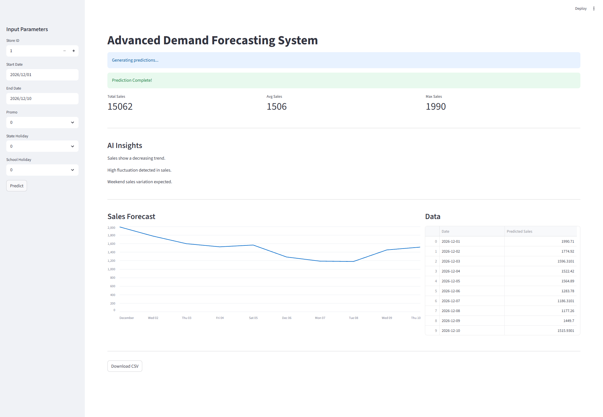

# Advanced Demand Forecasting System

## Live Demo

**Application URL:**
https://demand-forecasting-system-qwpwhonnc3ig58hccdguah.streamlit.app

---

## Application Preview



---

## Project Overview

The Advanced Demand Forecasting System is an end-to-end machine learning application designed to predict future retail sales using historical transactional data and time-series forecasting techniques.

The system combines feature engineering, machine learning, recursive forecasting, interactive visualization, and cloud deployment to deliver business-oriented sales predictions.

---

## Business Objective

Accurate demand forecasting is essential for retail organizations to:

* Optimize inventory management
* Reduce stock shortages and overstock situations
* Improve promotional planning
* Support operational decision-making
* Increase revenue through data-driven forecasting

This project addresses these challenges by generating store-level sales forecasts using historical sales patterns and business-related features.

---

## System Architecture

```text
User Input
    ↓
Feature Engineering
    ↓
Lag Features & Rolling Statistics
    ↓
XGBoost Model
    ↓
Recursive Forecasting
    ↓
Predictions
    ↓
Visualization & Insights
```

---

## Technology Stack

### Programming Language

* Python

### Data Processing

* Pandas
* NumPy

### Machine Learning

* Scikit-Learn
* XGBoost

### Application Development

* Streamlit

### Version Control & Deployment

* Git
* GitHub
* Streamlit Cloud

### Cloud Data Loading

* Google Drive
* gdown

---

## Feature Engineering

### Input Features

* Store
* Promo
* StateHoliday
* SchoolHoliday
* Year
* Month
* Day
* DayOfWeek

### Generated Features

#### Lag Features

* lag_1
* lag_7
* lag_30

#### Rolling Statistics

* rolling_mean_7
* rolling_mean_30
* rolling_std_7

These engineered features allow the model to capture both short-term and long-term sales behavior.

---

## Model Development

The following machine learning models were evaluated during experimentation:

1. Linear Regression
2. Random Forest Regressor
3. XGBoost Regressor

After comparative evaluation, XGBoost demonstrated the strongest predictive performance and was selected as the final production model.

---

## Model Performance

| Metric | Score |
| ------ | ----- |
| RMSE   | ~572  |
| MAE    | ~399  |
| MAPE   | ~5.7% |

### Model Selection Rationale

XGBoost was selected because it:

* Handles non-linear relationships effectively
* Performs well on structured tabular datasets
* Supports feature importance analysis
* Provides strong forecasting accuracy

---

## Forecasting Strategy

The system uses recursive forecasting for multi-day predictions.

For future dates beyond the available historical data:

1. The model predicts the next day.
2. The predicted value becomes part of the historical sequence.
3. The process repeats until the forecast horizon is completed.

This approach enables long-range forecasting while preserving temporal dependencies.

---

## Dashboard Features

### Inputs

* Store ID
* Forecast Start Date
* Forecast End Date
* Promotion Indicator
* State Holiday Indicator
* School Holiday Indicator

### Outputs

* Forecasted Sales Trend
* Daily Prediction Table
* Total Forecasted Sales
* Average Forecasted Sales
* Maximum Forecasted Sales
* Downloadable CSV Report

---

## Insights Layer

The application automatically analyzes generated forecasts and produces observations related to:

* Sales trends
* Forecast volatility
* Promotional influence
* Holiday effects
* Weekend sales behavior

---

## Deployment Strategy

GitHub file size limitations prevented direct storage of the complete dataset.

To address this limitation:

* Large datasets are hosted externally.
* Data is loaded dynamically at runtime.
* The application remains lightweight and deployment-friendly.

The application is publicly accessible through Streamlit Cloud.

---

## Running the Project Locally

```bash
pip install -r requirements.txt
streamlit run streamlit_app.py
```

---

## Project Structure

```text
Demand-Forecasting/
│
├── assets/
├── data/
├── outputs/
├── src/
│   ├── features/
│   ├── training/
│   ├── prediction/
│   └── utils/
│
├── streamlit_app.py
├── requirements.txt
├── README.md
└── .gitignore
```

---

## Key Learning Outcomes

This project demonstrates practical experience in:

* Time-Series Forecasting
* Feature Engineering
* Machine Learning Model Development
* Model Evaluation and Selection
* Recursive Forecasting
* Interactive Dashboard Development
* Cloud Deployment
* Git and GitHub Workflows
* Production-Oriented Machine Learning Systems

---

## Interview Summary

Developed and deployed an end-to-end demand forecasting system using time-series feature engineering and XGBoost. The solution incorporates lag and rolling statistical features, recursive forecasting, AI-driven insights, cloud-based data loading, and an interactive dashboard for business users. The project demonstrates the complete machine learning lifecycle from data preparation to public deployment.

---

## Author

Chandra Sekhar

Machine Learning | Data Science | Full Stack Development
